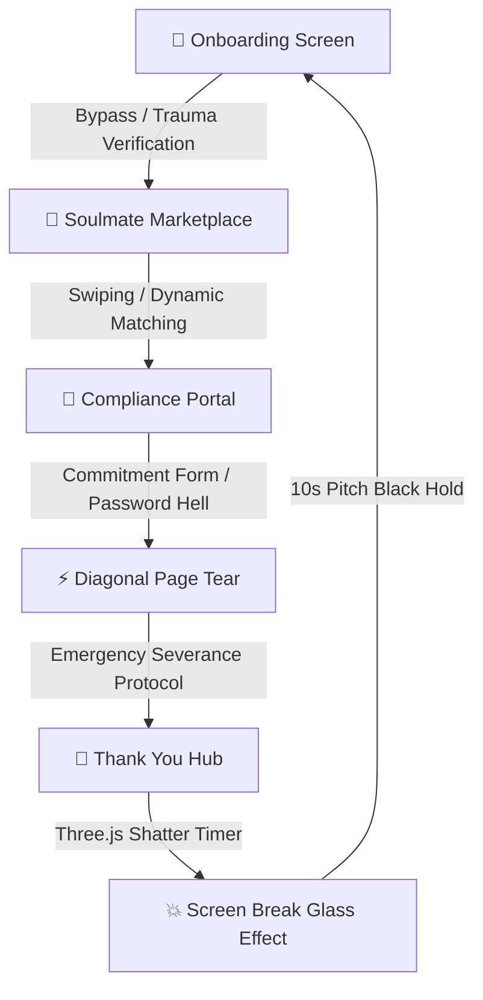

# 💔 DeluluMatch: The Ultimate Emotional Trauma Simulator

[](https://nextjs.org)
[](https://threejs.org)
[](https://tailwindcss.com)
[](https://framer.com/motion)

Welcome to **DeluluMatch**, the internet's premier award-worthy situationship & emotional-trauma simulation console. Designed with vibrant dark-cyber graphics, premium micro-animations, glassmorphic grids, and intentionally stressful Y2K retro UI mechanics, DeluluMatch pair-programs Next.js 15, Canvas fluid physics, and Three.js shattering calculations to create a gaming experience like no other.

---

## 🎨 System Architecture Flow

The matching pipeline processes trauma parameters and navigates users through progressive stages of attachment codependency:



---

## 🚀 Core Implemented Features

### 1. 🌊 Interactive Canvas Tsunami Water Engine
* **The Chaos:** The landing page features a fully realistic, real-time wave simulator that floods the screen dynamically.
* **Tech Stack:** Powered by HTML5 2D Canvas context rendering, combining sine-wave propagation matrices and particle spray buffers to simulate organic water rising.

### 2. 🧸 High-Fidelity Three.js Breakup Heart Engine
* **The Centerpiece:** Located on the **Thank You** page under the custom receipt printer.
* **The Animation:** Renders a 3D polygonal low-poly boy and girl character standing on glass blocks with an animated wireframe heart in between them.
* **Interactive Physics:** As the countdown approaches zero, the wireframe heart shatters and explodes into hundreds of glowing 3D vector shards floating into the canvas.

### 3. 💥 Three.js Glass Shatter Overlay
* **The Grand Finale:** 15 seconds after reaching the Thank You page, a loud glass fracturing sound plays, and a Three.js 3D viewport breaks the screen into realistic, jagged shards of reflecting glass.
* **Loopback Hold:** The screen goes completely pitch black for 10 seconds of absolute emotional reflection before reloading the onboarding page fresh from scratch!

### 4. 🧲 High-Performance Tearing Container Physics
* **Mechanics:** Enables horizontal and diagonal tears on user profile cards and registration contracts.
* **Underlayers:** The card splits cleanly under the user's cursor to expose warning summaries ("Still follows ex's Spotify hourly").

### 5. 🎯 Cursed Cursor Trail Engine
* **Aesthetics:** Custom-drawn Y2K emoji cursor trail with ghost particles (`💔` and `🤡`) tracking mouse movement with elastic inertia.
* **Form Immunity:** Features high-precision DOM element tracking that instantly hides all custom cursor elements and displays the native browser cursor the moment the pointer hovers over text inputs, selections, Roman numerals, or compliance form containers.

### 6. 🧹 Mount-Level Memory Cleansing
* **The Clean Reload:** Every single page transition is executed using full browser navigation (`window.location.href`) to reset the Zustand memory footprint.
* **Immediate Flush:** Every page mounts with a `clearPopups()` useEffect hook that guarantees no residual errors carry over from the previous view.

---

## 🛠️ Technical Stack & Dependencies

* **Core Framework:** [Next.js 15 (App Router)](https://nextjs.org/)
* **Languages:** TypeScript (Strict Compilation Mode)
* **3D & Vector Math:** [Three.js (r150)](https://threejs.org/) & `@types/three`
* **Animations:** [Framer Motion](https://www.framer.com/motion/) & CSS Custom Keyframes
* **Styles:** TailwindCSS (Custom configuration) & HSL theme tokens
* **Icons:** [Lucide React](https://lucide.dev/)
* **Audio Engine:** HTML5 Web Audio API Context provider with spatial panning
* **State Management:** [Zustand](https://github.com/pmndrs/zustand) (Normalized Client Store)

---

## ⚡ Developer Getting Started

### 1. Installation
Clone the repository and install all dependencies:
```bash
git clone https://github.com/adnanashraf-code/DeluluMatch.git
cd DeluluMatch
npm install
```

### 2. Run the Development Server
Launch the next compiler with Turbopack acceleration:
```bash
npm run dev
```
Open [http://localhost:3000](http://localhost:3000) with your browser to experience the simulation.

### 3. Build for Production
Validate types and compile a highly optimized standalone static application:
```bash
npm run build
```

---

## 📂 Design Tokens & Colors

DeluluMatch uses a curated color scheme designed to mimic late-90s hacker portals and digital cyberpunk spaces:

| Token | HSL / Hex Value | Element Usage |
| :--- | :--- | :--- |
| **Cyber Pink** | `hsl(330, 100%, 50%)` / `#FF007F` | Custom cursor trail, headlines, buttons, active warning popups |
| **Toxic Purple** | `hsl(270, 50%, 40%)` / `#8A2BE2` | Secondary red flags, matching percentages, scanning lasers |
| **Dark Onyx** | `hsl(280, 20%, 3%)` / `#080208` | Main canvas background, header panels, overlays |
| **System Green**| `hsl(120, 100%, 50%)` / `#32CD32` | Online active counters, match accuracy calculations |

---

## 💔 Situationship Disclaimer
*DeluluMatch is a simulated gaming interface intended purely for parody. All relationship match metrics, dry texting parameters, situationship attachment indices, and ex-alerts are generated algorithmically for entertainment purposes.*
